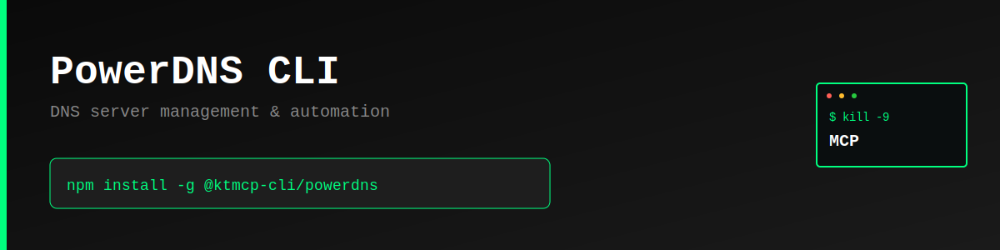

> "Six months ago, everyone was talking about MCPs. And I was like, screw MCPs. Every MCP would be better as a CLI."
>
> — [Peter Steinberger](https://twitter.com/steipete), Founder of OpenClaw
> [Watch on YouTube (~2:39:00)](https://www.youtube.com/@lexfridman) | [Lex Fridman Podcast #491](https://lexfridman.com/peter-steinberger/)

# PowerDNS CLI

Command-line interface for PowerDNS Authoritative HTTP API - Manage DNS servers, zones, and records from your terminal.

> **⚠️ Unofficial CLI** - This tool is not officially sponsored, created, or supported by PowerDNS. It's a community-built CLI for the PowerDNS API.

## Features

- 🌐 **Zone Management** - Create, list, get, and delete DNS zones
- 🗄️ **Server Operations** - List and manage PowerDNS servers
- 🔄 **Cache Control** - Flush cache entries on demand
- 📊 **Statistics** - Query server statistics
- ⚡ **Fast & Simple** - Direct API access from the command line

## Why CLI > MCP

CLIs are:
- **Faster** - No server overhead, direct execution
- **Simpler** - Standard UNIX tools, easy to integrate
- **Composable** - Pipe data, chain commands, automate workflows
- **Debuggable** - Clear inputs and outputs
- **Universal** - Works everywhere Node.js runs

## Installation

```bash
npm install -g @ktmcp-cli/powerdns
```

## Quick Start

```bash
# Configure API settings
powerdns configure --url http://localhost:8081/api/v1 --api-key YOUR_API_KEY --server-id localhost

# List all servers
powerdns servers

# List all zones
powerdns zones

# Create a zone
powerdns zone:create --name example.com

# Get zone details
powerdns zone:get --zone-id example.com

# Delete a zone
powerdns zone:delete --zone-id example.com

# Flush cache
powerdns cache:flush --name example.com

# Get statistics
powerdns statistics
```

## Commands

### `configure`

Configure API settings:

```bash
powerdns configure --url <api-url> --api-key <key> --server-id <server>
```

### `servers`

List all PowerDNS servers:

```bash
powerdns servers
powerdns servers --json
```

### `zones`

List all zones:

```bash
powerdns zones
powerdns zones --server-id localhost --json
```

### `zone:create`

Create a new DNS zone:

```bash
powerdns zone:create --name example.com
powerdns zone:create --name example.org --server-id localhost
```

### `zone:get`

Get zone details:

```bash
powerdns zone:get --zone-id example.com
powerdns zone:get --zone-id example.com --json
```

### `zone:delete`

Delete a zone:

```bash
powerdns zone:delete --zone-id example.com
```

### `cache:flush`

Flush a cache entry:

```bash
powerdns cache:flush --name example.com
```

### `statistics`

Get server statistics:

```bash
powerdns statistics
powerdns statistics --server-id localhost --json
```

## Support This Project

If you find this CLI useful, we'd appreciate support across Reddit, Twitter, Hacker News, or Moltbook. Please be mindful - these are real community accounts. Contributors who can demonstrate their support helped advance KTMCP will have their PRs and feature requests prioritized.

## API Documentation

- [PowerDNS API Documentation](https://doc.powerdns.com/authoritative/http-api/)

## License

MIT © KTMCP

---

**Part of the [Kill The MCP](https://killthemcp.com/powerdns-cli) project** - Simple CLIs over complex protocols.


---

## Support KTMCP

If you find this CLI useful, we'd greatly appreciate your support! Share your experience on:
- Reddit
- Twitter/X
- Hacker News

**Incentive:** Users who can demonstrate that their support/advocacy helped advance KTMCP will have their feature requests and issues prioritized.

Just be mindful - these are real accounts and real communities. Authentic mentions and genuine recommendations go a long way!

